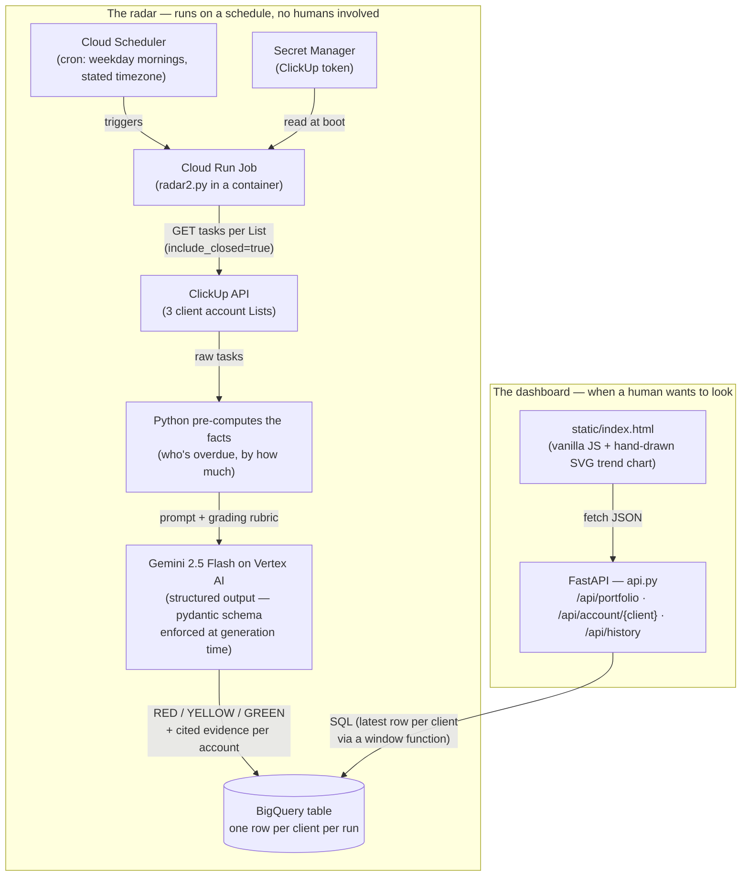

# ClickUp Health Radar 📡

An AI "account health radar": every weekday morning it reads a ClickUp workspace
(three fictional client accounts with known ground truth), asks Gemini *"how healthy
is each client relationship?"*, forces the answer into a strict schema, and appends
the verdicts to BigQuery — so health becomes a **trend with receipts**, not a
one-off opinion. A small hand-rolled dashboard reads that history back for a human.

Built by Josh White ([corduroyfields](https://github.com/corduroyfields)) as
interview prep for a ClickUp Senior TAM role and as a portfolio artifact. The most
important deliverable is [`clickup-notes.md`](clickup-notes.md) — honest,
field-note-style friction observations gathered while building against ClickUp's
API and comparing four AI approaches on identical data.

## How it works

Top half: a scheduled job pulls every task from ClickUp, computes the objective
numbers in Python (LLMs are unreliable calculators), and hands only the *judgment*
call to Gemini — whose answer must fit an exact schema, so it can become a database
row instead of prose. Bottom half: a deliberately framework-free web page fetches
that history through three small API endpoints and draws it — one dot per run, so
the AI's verdict jitter stays visible instead of smoothed away.

## Repo map

| File | What it is |
|---|---|
| `radar2.py` | The radar, v2 — structured output. **The current best version.** |
| `radar.py` | v1 — free-text output; kept to show the before/after. |
| `seed_workspace.py` | Rebuilds the test workspace (idempotent: delete-then-rebuild). |
| `main.py` | ClickUp auth smoke test. |
| `api.py` + `static/index.html` | The dashboard: FastAPI backend + one hand-written page. Runs locally; cloud deploy was deliberately cut (documented in `phases/phase-4-frontend.md`). |
| `clickup-notes.md` | **The real deliverable** — friction notes and four-way AI comparison. |
| `PLAN.md` + `phases/` | Roadmap and per-phase working files, with handoffs. |
| `interview-summary.md` | One-pager distilled from the notes. |

## Status

**Complete** (July 2026). The GCP project is intentionally left live, but the
ClickUp trial workspace behind it has expired — so re-running against the live API
now fails auth. That's expected and documented; the artifacts (notes, history,
this repo) are the point.

## License

MIT — see [LICENSE](LICENSE).
